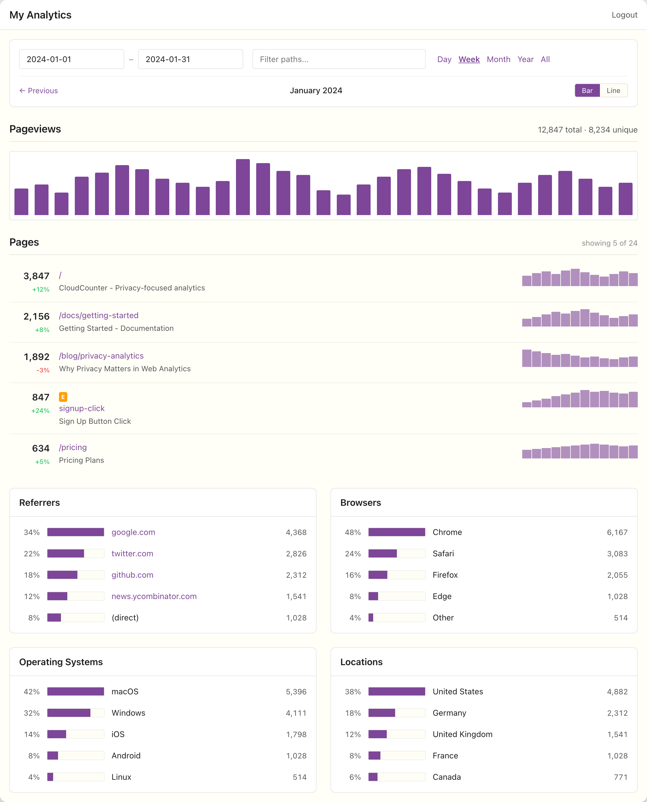
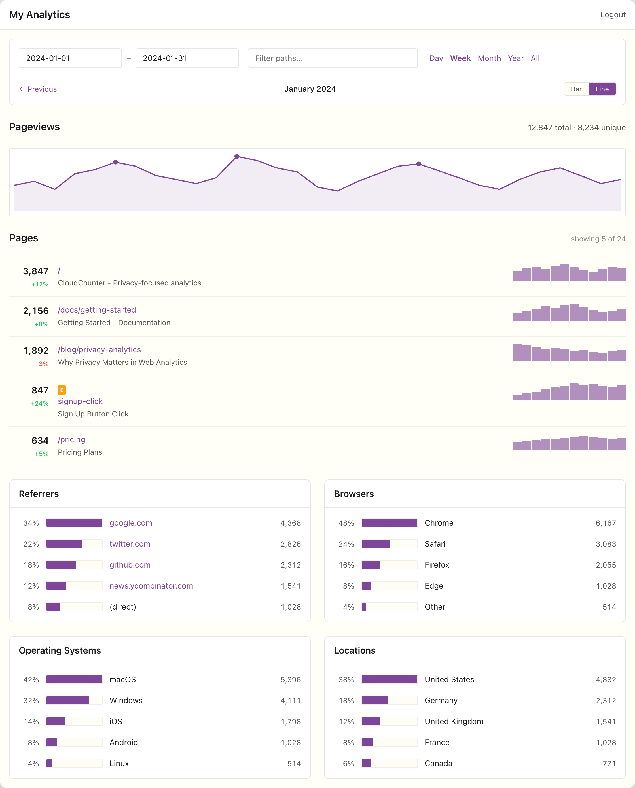

<p align="center">
  
</p>

<p align="center">
  <a href="https://opensource.org/licenses/EUPL-1.2">
    
  </a>
</p>

A standalone port of [GoatCounter](https://github.com/arp242/goatcounter) to run entirely on Cloudflare's edge infrastructure.

CloudCounter brings GoatCounter's privacy-focused analytics to Cloudflare Pages + D1, requiring no external servers or databases. Deploy once and track pageviews across your sites with a single JavaScript snippet.

## Features

- Pageview tracking with session deduplication
- Top pages, referrers, browsers, operating systems, locations
- Screen size breakdown
- Event tracking support
- Privacy-first: no cookies, session hash only
- Server-rendered dashboard
- Data retention policies

## Screenshots

<p align="center">
  
</p>

<p align="center">
  
</p>

Additional screenshots available in the [media](media/) folder.

## Prerequisites

- Node.js 18+
- [Wrangler CLI](https://developers.cloudflare.com/workers/wrangler/install-and-update/)
- Cloudflare account with Pages and D1 access

## Quick Start

### 1. Clone and install

```bash
git clone https://github.com/philippdubach/cloudcounter.git
cd cloudcounter
npm install
```

### 2. Create Cloudflare resources

```bash
# Create D1 database
wrangler d1 create cloudcounter

# Create KV namespace for sessions
wrangler kv namespace create SESSIONS
```

### 3. Update wrangler.toml

Edit `wrangler.toml` and add your database_id and KV namespace id:

```toml
[[d1_databases]]
binding = "DB"
database_name = "cloudcounter"
database_id = "YOUR_DATABASE_ID_HERE"

[[kv_namespaces]]
binding = "SESSIONS"
id = "YOUR_KV_NAMESPACE_ID_HERE"
```

### 4. Initialize database

```bash
wrangler d1 execute cloudcounter --file=./migrations/0001_init.sql
```

### 5. Set dashboard password

```bash
wrangler secret put DASHBOARD_PASSWORD
```

### 6. Deploy

```bash
wrangler pages deploy public
```

### 7. Add tracking script to your site

```html
<script async src="https://your-analytics.pages.dev/count.js"></script>
```

## Local Development

```bash
# Start local dev server
npm run dev

# Apply migrations to local D1
npm run db:migrate:local
```

## Configuration

### Environment Variables

| Variable | Description | Default |
|----------|-------------|---------|
| `SITE_NAME` | Dashboard title | "My Analytics" |
| `DATA_RETENTION_DAYS` | Days to keep data (0 = unlimited) | "0" |

### Secrets

| Secret | Description |
|--------|-------------|
| `DASHBOARD_PASSWORD` | Password for dashboard access |

## Tracking Script

### Basic usage

The script auto-tracks pageviews on load:

```html
<script async src="https://your-analytics.pages.dev/count.js"></script>
```

### Manual tracking

```javascript
// Custom pageview
cloudcounter.count({ path: '/custom-path', title: 'Custom Title' });

// Event tracking
cloudcounter.count({ path: 'button-click', title: 'Sign Up Button', event: true });
```

### Click tracking

Add `data-cloudcounter-click` attribute to elements:

```html
<button data-cloudcounter-click="signup-btn">Sign Up</button>
```

### Disable tracking

```javascript
cloudcounter.skip();   // Disable for this session
cloudcounter.enable(); // Re-enable
```

## API

### Track pageview

```
GET/POST /api/count?p=/path&t=Title&r=referrer
```

| Parameter | Description | Required |
|-----------|-------------|----------|
| `p` | Page path | Yes |
| `t` | Page title | No |
| `r` | Referrer URL | No |
| `e` | Event flag (1 or true) | No |
| `s` | Screen width | No |

Returns: 1x1 transparent GIF

## Architecture

```
cloudcounter/
├── functions/           # Cloudflare Pages Functions
│   ├── _middleware.ts   # Auth guard
│   ├── _worker.ts       # Cron handler
│   ├── api/count.ts     # Hit tracking endpoint
│   ├── index.ts         # Dashboard
│   ├── login.ts         # Login page
│   └── logout.ts        # Logout
├── src/
│   ├── lib/             # Core utilities
│   └── stats/           # Query functions
├── public/
│   ├── count.js         # Tracking script
│   ├── dashboard.js     # Dashboard charts
│   └── dashboard.css    # Dashboard styles
└── migrations/          # D1 schema
```

## Database Schema

| Table | Description |
|-------|-------------|
| `paths` | Normalized page paths |
| `refs` | Referrer URLs |
| `browsers` | Browser names |
| `systems` | Operating systems |
| `hits` | Raw pageview data |
| `hit_counts` | Hourly aggregates |
| `hit_stats` | Daily aggregates |
| `browser_stats` | Browser breakdown |
| `system_stats` | OS breakdown |
| `location_stats` | Country breakdown |
| `size_stats` | Screen size breakdown |

## Cron Jobs

Daily at 3 AM UTC:
- Apply data retention policy
- Vacuum unused referrers
- Clean orphaned dimension records

## Credits

This project is a port of [GoatCounter](https://github.com/arp242/goatcounter) by Martin Tournoij.

## License

Licensed under the [EUPL](https://opensource.org/licenses/EUPL-1.2).
